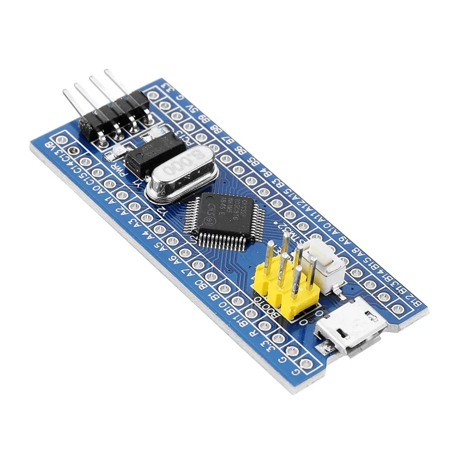
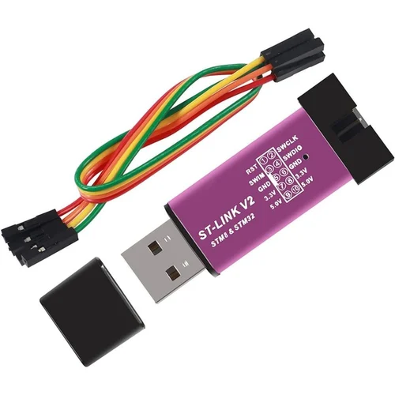

This first tutorial covers the installation and configuration for OpenOCD on a debian based machine.

[About the STM32](https://en.wikipedia.org/wiki/STM32) 

You need an interface that will make the connection between your chip and the computer. Here I use a ST-LINK V2 USB dongle (ST-LINK programmer and debugger). 

[About the ST-LINK V2 (the programmer)](https://stm32world.com/wiki/DIY_STM32_Programmer_(ST-Link/V2-1))



### OpenOCD - Open On Chip Debugger- Source code
[Source](https://sourceforge.net/p/openocd/code/ci/master/tree/)

## GDB

Before beginning debugging, I recommend that you familiarize yourself with the fundamental concepts behind GDB. 

Breakpoints allow you to pause execution and observe the proceedings while running various commands.

You can see how the executable behaves by examining assembly code as it runs on the machine, for examples through register inspection. 

The objective of this low-level approach is to comprehend the machine's activities from a memory perspective.

For more insights on why memory allocation matters, refer to this resource: [Memory management](https://en.wikipedia.org/wiki/Memory_management)

I also suggest utilizing [GEF](https://github.com/hugsy/gef), a GDB plugin which integrates features like colored output and segmented information display for registers, stack, flags, and miscellaneous commands. 

### Installation

First, in order to install OpenOCD properly and don’t mess with the configuration, I recommend trying the easy way installation.

Run an ```apt-get install openocd``` directly from your Debian GNU Linux distribution.

### Running

Once you run the program, choose in the folders of the ```.cfg``` files for your interface name and your chip name.

Run the command :
```
      $sudo openocd -f [interface] -f[target]
```
This will initialize OpenOCD with the configuration files you give as parameters with the -f option. OpenOCD will find itself which configuration to apply and will run the debug server as referenced with default ports:

3333 for GDB
4444 for Telnet

In another window of your terminal, you initialize a telnet/gdb connection with your chip using your local loop:

To do so, inside GDB type the command:
```
    $target remote localhost:3333
```

If you didn’t get lucky and configuration didn’t work, it’s ok. Just follow the following sections.

First check if you have Python and GDB updated and working correctly on your machine, then reinstall GEF.

Installing Open OCD is quite straightforward if you respect the instructions on the SourceForge [page](https://openocd.org/pages/getting-openocd.html) of the project. What you’ll do is to build the application on your own machine. 
Instructions for building comes with dependencies installation that you must have installed.
 
Each time you change something related to these dependencies, you have to recompile the program, it includes reloading the installation framework updated with configurations you changed. 
```
$make re
```
OpenOCD is installed

Now go to the main folder where is your openocd executable.
As we previously mentioned there are folders what would be useful to take a look :

- chip
- interface
- target
- board

For example, you’ll need to go to /interface to match your interface name.
```
$openocd -h
```

Show the basic commands you can run with their parameters:

```
~~~~shell
    $ openocd -h

Open On-Chip Debugger 0.10.0+dev-00510-g766d611 (2018-08-10-17:46)

Licensed under GNU GPL v2

For bug reports, read
http://openocd.org/doc/doxygen/bugs.html

Open On-Chip Debugger

Licensed under GNU GPL v2

–help | -h display this help

–version | -v display OpenOCD version

–file | -f use configuration file <name>

–search | -s dir to search for config files and scripts

–debug | -d set debug level to 3

| -d<n> set debug level to <level>

–log_output | -l redirect log output to file <name>

–command | -c run <command>
```

Tip: In case you need to debug your openocd command, the first line gives you precious information about the version you installed on your machine.

After you selected the names of your interface and board (a quick look at the .cfg files will inform you also), you can ask Openocd to directly include these file with the -s option. 

Or you can to write the full path of the .cfg files you want to include.

Run the debugging server:

```
    $ sudo openocd -f [interface] -f[target]
```

It will ask for your root password.

```
Open On-Chip Debugger 0.10.0+dev-00510-g766d611 (2018-08-10-17:46)

Licensed under GNU GPL v2

For bug reports, read
[http://openocd.org/doc/doxygen/bugs.html](http://openocd.org/doc/doxygen/bugs.html)

WARNING: interface/stlink-v2.cfg is deprecated, please switch to interface/stlink.cfg

Info : auto-selecting first available session transport « hla_swd ». To override use ‘transport select <transport>’.

Info : The selected transport took over low-level target control. The results might differ compared to plain JTAG/SWD

adapter speed: 1000 kHz

adapter_nsrst_delay: 100

none separate

Info : Listening on port 6666 for tcl connections

Info : Listening on port 4444 for telnet connections

Info : Unable to match requested speed 1000 kHz, using 950 kHz

Info : Unable to match requested speed 1000 kHz, using 950 kHz

Info : clock speed 950 kHz

Info : STLINK v2 JTAG v17 API v2 SWIM v4 VID 0x0483 PID 0x3748

Info : using stlink api v2

Info : Target voltage: 3.241744

Info : stm32f1x.cpu: hardware has 6 breakpoints, 4 watchpoints

Info : Listening on port 3333 for gdb connections

~~~~
```

Brilliant ! So what does it tell us? That everything is working, even if I have a warning, telling me in this example that my version of ST-LINK v2 file is depreciated. 


- Listening ports
- Clock speed
- Interface
- Target Voltage
- Listening port for gdb 3333

### Start Debugging!

\o/


### Trouble shooting

ARM architecture-specific GDB configuration: search into your package manager if you have not gdb-arm-none-eabi installed:
```
    $ sudo apt-cache search gdb-arm-none-eabi

gdb-arm-none-eabi – GNU debugger for ARM Cortex-A/R/M processors

    $ sudo apt-get install gdb-arm-none-eabi
```

Then instead of running gdb this way

```
$gdb
```
do

```
$gdb-arm-none-eabi

$target remote:3333

$info register
```

Ping me if you need any help.

